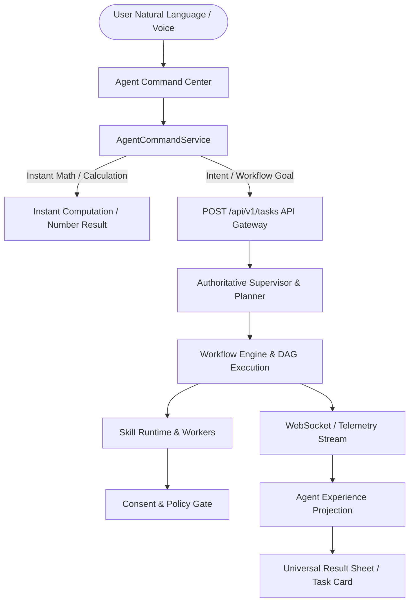

# ABHI Agent Command Center Architecture (Phase 9 Stage 2)

## 1. Executive Vision
The **Unified Agent Command Center** transforms ABHI from a collection of fragmented application routes into a unified, intent-driven **Personal AI Computer Automation System**. The primary human-to-machine loop is:



## 2. Core Architectural Components

### 2.1 AgentCommandCenterComponent
- **Location**: `frontend/src/app/shared/ui/agent-command-center/agent-command-center.component.ts`
- **Responsibilities**:
  - Central natural language input field with glassmorphic focus aura and micro-animations.
  - Multilingual suggestion pills covering English, Telugu (తెలుగు), Hindi (हिंदी), and Tamil (தமிழ்).
  - Voice simulation and STT pipeline integration with `LISTENING` / `PROCESSING` / `SPEAKING` indicators.
  - Polymorphic outcome projection rendering `UniversalResultSheetComponent` and `AgentTaskCardComponent`.

### 2.2 AgentCommandService
- **Location**: `frontend/src/app/core/services/agent-command.service.ts`
- **Responsibilities**:
  - Request ingestion via `AgentCommandRequest` data contracts.
  - Language detection and canonicalization (`auto`, `en`, `te`, `hi`, `ta`).
  - Safe, local mathematical short-circuiting for zero-latency direct arithmetic queries (`125 * 48 = 6000`).
  - Media search and library routing.
  - Short-lived, bounded conversational context for follow-up adjustments (TTL 5 minutes).
  - Sensitive command sanitization (passwords, tokens, API keys excluded from client persistence).

### 2.3 UniversalResultSheetComponent
- **Location**: `frontend/src/app/shared/ui/result-sheet/result-sheet.component.ts`
- **Responsibilities**:
  - Polymorphic result rendering for `NUMBER_RESULT`, `MEDIA_RESULT`, `SEARCH_RESULTS`, `TASK_RESULT`, `APPLICATION_RESULT`, and `ERROR_RESULT`.
  - Outcome-first presentation with quick action triggers (`Open`, `View`, `Copy`, `Dismiss`).

### 2.4 AgentTaskCardComponent
- **Location**: `frontend/src/app/shared/ui/agent-task-card/agent-task-card.component.ts`
- **Responsibilities**:
  - Real-time progress display with humanized stage descriptions.
  - Cancellation hook dispatching to backend task termination endpoint.
  - Deep-linking to `/tasks/{task_id}` for advanced inspection.

## 3. Command Lifecycle State Machine
```text
RECEIVED ──► UNDERSTANDING ──► PLANNING ──► WAITING_FOR_APPROVAL ──► EXECUTING ──► VERIFYING ──► COMPLETED
   │                │              │                 │                  │              │            ▲
   ▼                ▼              ▼                 ▼                  ▼              ▼            │
 FAILED           FAILED         FAILED          CANCELLED            FAILED        RECOVERING ─────┘
```

## 4. Experience Projections
1. **User Mode (Default)**:
   - Shows humanized actions: *"Opening Calculator"*, *"Working..."*, *"Calculation Complete"*.
   - Technical node IDs, leases, and worker PIDs are strictly hidden.
2. **Advanced Mode**:
   - Shows workflow milestones, active node descriptions, resource usage summaries, and artifact lineage.
3. **Developer Mode**:
   - Exposes raw command IDs, task IDs, execution logs, skill leases, worker process telemetry, and verification hashes.
