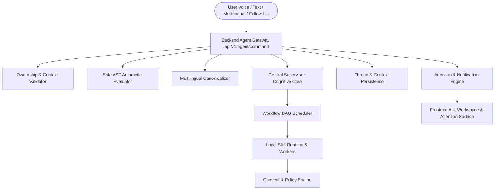

# Authoritative Agent Gateway Architecture (Phase 9 Stage 3)

## 1. Executive Summary
The **Authoritative Agent Gateway** (`backend/app/cognitive/gateway/agent_gateway.py`) establishes a single, unified entry point for all natural language, voice, and system event interactions within the ABHI Personal AI Computer. 

It explicitly rectifies frontend semantic drift: **the frontend UI is strictly a presentation and interaction layer**, while the backend Gateway owns command ingestion, schema validation, deterministic arithmetic evaluation, multilingual canonicalization, and Supervisor dispatching.

## 2. Gateway Capabilities
1. **Multimodal Ingestion**:
   - Accepts `TEXT`, `VOICE`, `SYSTEM_EVENT`, and `FOLLOW_UP` input modes.
   - Attaches bounded context (`AgentContext`) validated against backend records.
2. **Safe Deterministic Arithmetic Evaluation**:
   - Expressions like `"calculate 125 * 48"` or `"what is 250 - 50 + 25"` are parsed into safe AST representations in Python and evaluated with strict numeric boundaries, eliminating arbitrary eval risks and ensuring authoritative computation.
3. **Multilingual Canonicalization**:
   - Integrates `LanguageCanonicalizer` supporting English, Telugu (`te`), Hindi (`hi`), and Tamil (`ta`) with mixed code-switching detection.
4. **Follow-Up Resolution**:
   - Seamlessly links conversational follow-ups (e.g. `"make it darker"`) to active artifact or task context. Resolves ambiguity by prompting for clarification when multiple candidates exist.
5. **Privacy Sanitization**:
   - Strips passwords, tokens, private keys, and OTPs before recording command entries in persistent thread history.
