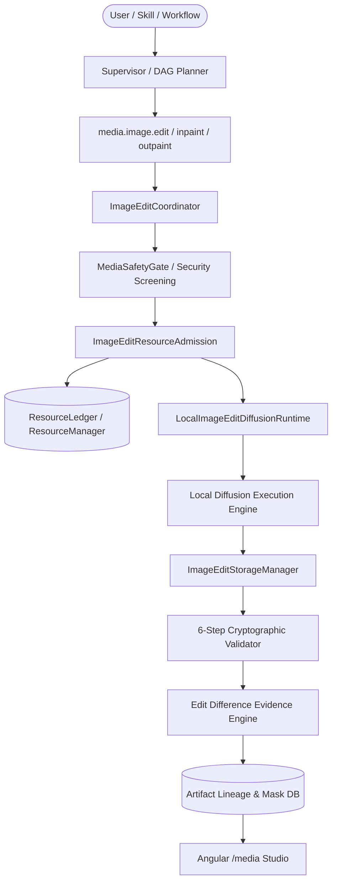

# Phase 8 Stage 8.3 — Local Image Editing, Inpainting & Outpainting Architecture

## 1. System Overview

Phase 8 Stage 8.3 establishes the **Local Image Editing, Inpainting & Outpainting Runtime** for ABHI (Local-First Personal AI Computer Automation System). It enables local-first, resource-governed latent transformations, soft-boundary masked inpainting, and directional canvas outpainting.

The fundamental architectural principle is:
```
ORIGINAL MEDIA ARTIFACT (Immutable Source)
               │
               ▼
       ImageEditRequest
               │
               ▼
     ImageEditCoordinator
               │
               ▼
       ImageEditRuntime
               │
               ▼
   NEW VERIFIED MEDIA ARTIFACT
               │
               ▼
     ArtifactLineageRecord (Immutable Lineage & Diff Evidence)
```

---

## 2. Core Operational Primitives

### 2.1 Image-to-Image (`IMAGE_TO_IMAGE`)
- **Latent Conditioning**: Strength-controlled variation ($S \in [0.05, 1.0]$) mapping source image pixels to latent space with text-guided diffusion steps.
- **Model Adapter**: `instruct-pix2pix-local` (FP16 quantized, 3,200 MB base VRAM).

### 2.2 Inpainting (`INPAINTING`)
- **Contract**: Masked region replacement ($M(x,y) = 255$) with unmasked background preservation ($M(x,y) = 0$).
- **Boundary Feathering**: Soft Gaussian edge feathering ($k=7$) to eliminate seam artifacts and blend transitions.
- **Model Adapter**: `sdxl-inpainting-local` (FP16, 4,800 MB base VRAM).

### 2.3 Outpainting (`OUTPAINTING`)
- **Canvas Expansion**: Directional extension (Top, Bottom, Left, Right) within bounded limits ($\le 512$ px expansion).
- **Deterministic Mask Generation**: Automatically synthesizes border masks where expanded areas are marked $255$ (edit) and original canvas is preserved at $0$.
- **Model Adapter**: `kandinsky-outpainting-candidate` (Candidate isolation, 4,200 MB base VRAM).

---

## 3. Component Architecture & Data Flow



---

## 4. Hardware & Resource Governance

- **Target System**: AMD Ryzen 7 260 (8C/16T, 24 GB RAM), NVIDIA RTX 5050 Laptop GPU (~8 GB VRAM).
- **VRAM Hard Ceiling**: 6,400 MB max allocation with >1,200 MB safety headroom.
- **Dynamic Allocation**:
  $$\text{VRAM}_{\text{est}} = \text{BaseVRAM} \times \left(1 + 0.5 \cdot \left(\frac{W \times H}{512^2} - 1\right)\right) \times \text{OpMultiplier} \times \text{StepFactor} \times \text{StrengthFactor}$$
- **Preemption & Fallback**: Seamless fallback to host RAM / CPU when discrete GPU VRAM headroom is constrained.

---

## 5. Storage Hierarchy & Lineage Integrity

- **Canonical Path**: `media/images/edits/YYYY/MM/`
- **Masks Path**: `media/masks/YYYY/MM/`
- **Sandbox**: `media/temp/edit_<job_id>/` (automatically cleaned upon success, failure, cancel, or timeout).
- **Lineage Tracking**:
  - Parent Artifact ID
  - Child Artifact ID
  - Job ID & Parameters Hash
  - `EditDifferenceEvidence` (changed pixel count, changed ratio, bounding box, mask overlap ratio).
