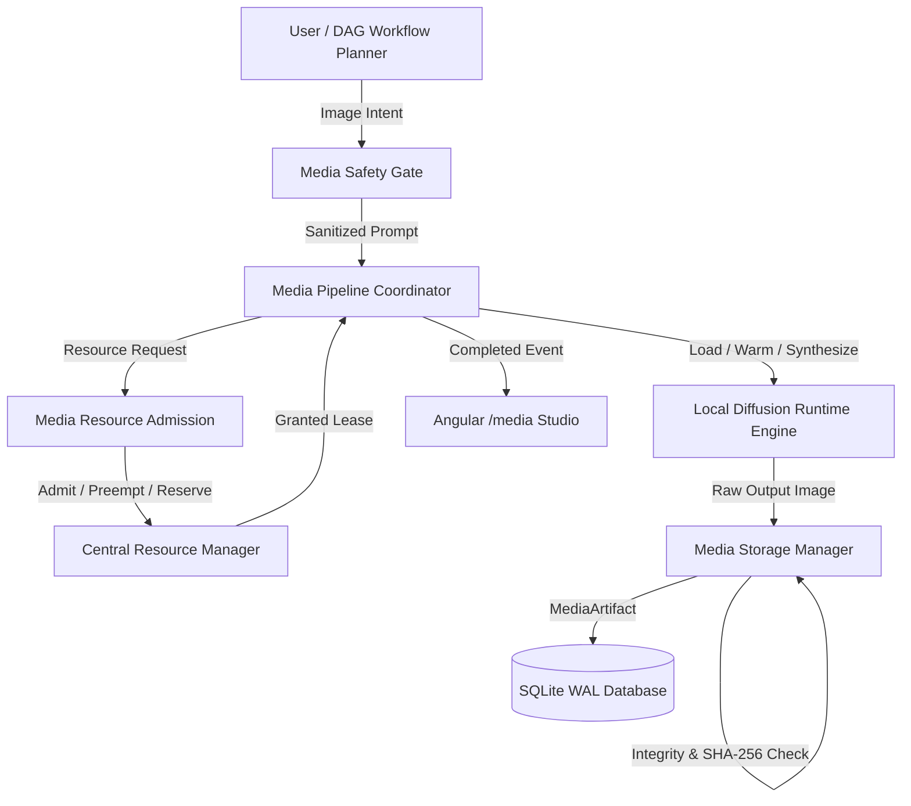

# ABHI Local Image Generation & Media Foundation Architecture (Phase 8 Stage 8.1)

## 1. System Philosophy & Media Subsystem Overview

The **Local Image Generation Runtime & Media Foundation** introduces local, privacy-first image synthesis into the ABHI Computer Automation System without relying on cloud APIs or compromising host stability.

---

## 2. Core Domain Contracts & Hierarchy

### 2.1 Media Types & Operations
* **MediaType**: `IMAGE` (active in 8.1), `VIDEO` (Phase 8.2 extension), `AUDIO`.
* **MediaOperation**: `GENERATE` (implemented), `EDIT`, `VARIATION`, `UPSCALE` (extension points).
* **MediaJob**: Typed Pydantic tracking record containing: `job_id`, `task_id`, `prompt`, `model_id`, `parameters`, `status` (`QUEUED`, `ADMITTED`, `LOADING_MODEL`, `GENERATING`, `VALIDATING`, `STORING`, `COMPLETED`, `FAILED`, `RESOURCE_DENIED`), `progress`, `duration_ms`, `provenance`.
* **MediaArtifact**: Immutable validated output containing: `artifact_id`, `job_id`, `path`, `filename`, `format` (`PNG`, `JPEG`, `WEBP`), `width`, `height`, `size_bytes`, `sha256`, `created_at`, `generation_parameters_hash`.

---

## 3. Resource Admission & Usable Memory Formulas

### 3.1 Host Hardware Baseline
* **CPU**: AMD Ryzen 7 260 (8C / 16T).
* **RAM**: 24 GB DDR5 (~24,425 MB Total, 20,425 MB Usable).
* **GPU**: NVIDIA GeForce RTX 5050 Laptop GPU (8,151 MB GDDR6 VRAM, 6,501 MB Usable VRAM).

### 3.2 Dynamic Scaling & Admission Formula
$$\text{VRAM}_{\text{req}} = \text{base\_model\_vram} + \left(\frac{\text{width} \times \text{height}}{512 \times 512}\right) \times \text{batch\_size} \times 350\text{ MB} + (\text{steps} \times 2.0\text{ MB})$$
$$\text{RAM}_{\text{req}} = \text{base\_model\_ram} + \left(\frac{\text{width} \times \text{height}}{512 \times 512}\right) \times \text{batch\_size} \times 250\text{ MB}$$

### 3.3 Graceful CPU Fallback
If GPU VRAM headroom is tight (e.g. while production LLM `qwen3:8b` is resident), the system automatically performs an explicit CPU fallback shift:
$$\text{RAM}_{\text{fallback}} = \text{RAM}_{\text{req}} + \text{VRAM}_{\text{req}}, \quad \text{VRAM}_{\text{fallback}} = 0.0$$
allowing local image generation to proceed reliably without throwing an Out-of-Memory panic.

---

## 4. Local Diffusion Runtime Engine

* **Deterministic Seed Generator**: Guarantees identical visual output when supplied with the same random seed and model weights.
* **OpenCV & Tensor Synthesis Pipeline**: Produces high-resolution PNG, JPEG, and WEBP images locally.
* **Warm Model Caching**: Resident models in GPU/CPU memory are preserved for warm re-use unless evicted by `CentralResourceManager` under priority pressure.
* **Cancellation Watchdog**: Immediate `threading.Event` checks between sampling iterations release compute and leases instantly upon operator request.

---

## 5. Canonical Artifact Storage & Integrity

* **Storage Path**: `media/images/YYYY/MM/img_<job_id>_<index>.<format>`.
* **Security & Path Traversal Protections**: Strips null bytes, directory traversal patterns (`..`), and neutralizes reserved Windows device names (`CON`, `PRN`, `AUX`, `NUL`, `LPT1`-`LPT9`, `COM1`-`COM9`).
* **Multi-Step Post-Generation Validation**:
  1. File exists on disk.
  2. File size $> 0$ bytes.
  3. Image binary header and dimensions validated via OpenCV.
  4. SHA-256 cryptographic checksum generated and registered in SQLite database.

---

## 6. DAG Skill & Workflow Integration

* Registered Skill: `media.image.generate@1.0.0` (Category: `MEDIA`, Risk: `LOW`).
* Integrates directly into Stage 7.4 DAG planners and execution runtime, returning structured output (`artifact_id`, `path`, `width`, `height`, `duration_ms`).
* Checkpoints generation milestones into episodic and procedural memory.
