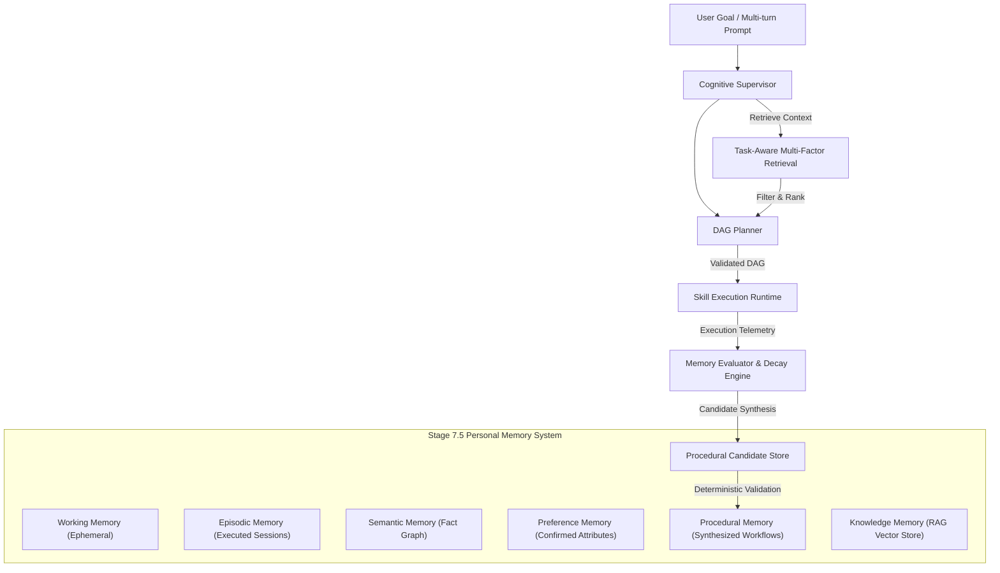
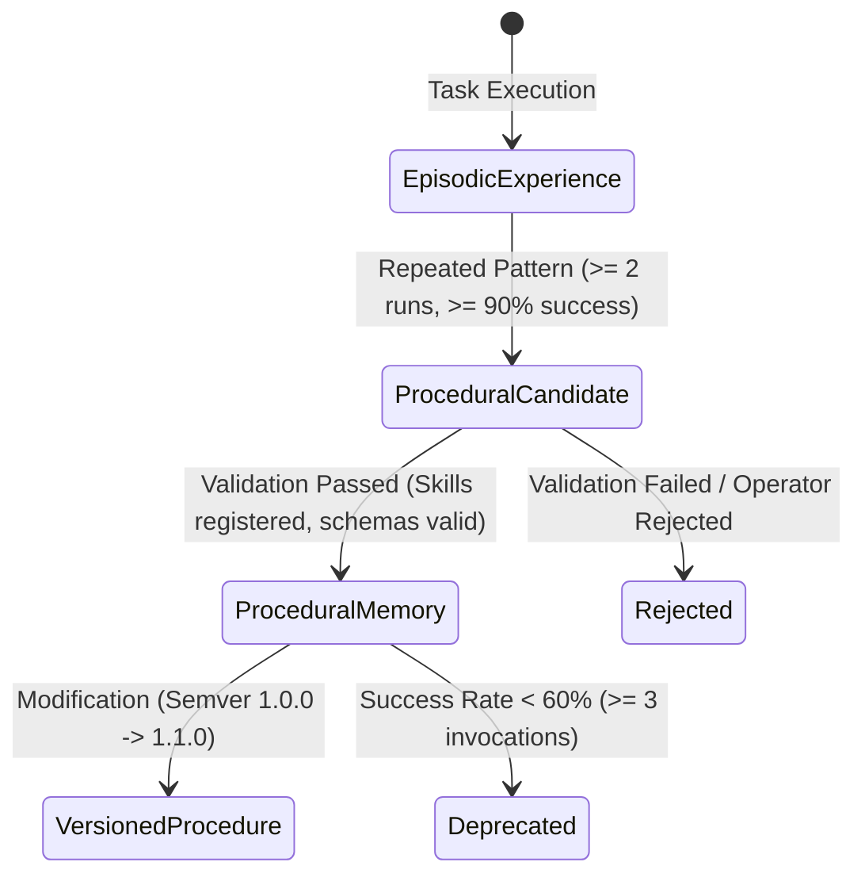

# Personal & Procedural Memory Architecture (Stage 7.5)

## Local-First Autonomous AI Computer Automation System

---

## 1. Architectural Overview

The **Personal & Procedural Memory System** enables ABHI to safely capture, structure, validate, retrieve, and promote experiential context across local workflows. The architecture strictly enforces memory boundaries, preventing temporary context from polluting persistent knowledge and ensuring that memory acts exclusively as planning guidance—never as an authorization bypass.



---

## 2. Distinct Memory Segments & Lifecycles

| Memory Segment | Scope & Purpose | Persistence Store | Decay Half-Life | Authority Level |
|---|---|---|---|---|
| **Working Memory** | Active task context, active browser tabs, focused window, current step | In-Memory Session Cache | 15 Minutes | 80 (Goal-Scoped) |
| **Episodic Memory** | Historical task execution runs, outcomes, duration, recovery events | SQLite WAL (`episodic_memories`) | 180 Days | 50 (Observational) |
| **Semantic Memory** | Stable facts, project paths, tooling conventions | In-Memory + SQLite WAL | 30 Days | 50 (Observational) |
| **Preference Memory** | Explicit/confirmed user configuration (theme, editor, language) | SQLite WAL (`user_profiles`) | 90 Days | 60 (User Confirmed) |
| **Procedural Candidate** | Repeated successful multi-step workflow clusters ($\ge 2$ runs) | Procedural Candidate Store | 7 Days | 40 (Candidate) |
| **Procedural Memory** | Validated, versioned, reusable execution DAGs | Procedural Registry | Permanent / Versioned | 60 (Validated) |
| **Knowledge Memory** | Ingested documents, manuals, local codebases | LanceDB Vector Store | Source Governed | 40 (External Data) |

---

## 3. Strongly-Typed Memory Contract

All long-term and candidate memory records conform to the unified `MemoryContract`:

```python
class MemoryContract(BaseModel):
    memory_id: str
    memory_type: MemoryType
    title: str
    summary: str
    content: Dict[str, Any]
    source: MemorySource
    confidence: float = Field(..., ge=0.0, le=1.0)
    privacy_classification: PrivacyClassification
    status: MemoryStatus
    created_at: datetime
    updated_at: Optional[datetime]
    expires_at: Optional[datetime]
    last_accessed_at: Optional[datetime]
    access_count: int
    version: str
    provenance: Dict[str, Any]
    tags: List[str]
    source_reference: Optional[str]
    confirmed_by_user: bool
    conflict_resolved: bool
```

---

## 4. Deterministic Confidence & Decay Model

Confidence is evaluated numerically without stochastic drift:

$$\text{Initial Confidence} = \begin{cases}
1.00 & \text{if } \text{Source} = \text{USER\_EXPLICIT} \\
0.95 & \text{if } \text{Source} = \text{USER\_CONFIRMED} \\
0.80 & \text{if } \text{Source} = \text{WORKFLOW\_RESULT} \\
0.75 & \text{if } \text{Source} = \text{EXECUTION\_RESULT} \\
0.60 & \text{if } \text{Source} = \text{SYSTEM\_OBSERVED} \\
0.30 & \text{if } \text{Source} = \text{UNTRUSTED\_EXTERNAL}
\end{cases}$$

Reinforcement on verification increases confidence by $+0.05$ (capped at $1.00$). Contradictions trigger conflict records and reduce confidence by $-0.20$.

Decay follows the standard half-life exponential curve:

$$\text{Confidence}(t) = \text{Initial Confidence} \times 2^{-\frac{\Delta t}{T_{\text{half-life}}}}$$

When $\text{Confidence}(t) < 0.20$ or $t > \text{expires\_at}$, the record transitions to `MemoryStatus.STALE`.

---

## 5. Procedural Memory Synthesis & Lifecycle

Procedural memory promotes repeated successful workflows into deterministic reusable templates:



### Safety Rules:
1. **No Arbitrary Code**: Procedures only store registered skill IDs, parameterized JSON schemas, preconditions, and postconditions.
2. **Runtime Confinement**: Procedures are translated back into validated DAG plan nodes and executed through `SkillExecutionRuntime` under active leases and policy gates.
3. **Semver Versioning**: Historical versions are preserved with lineage (`derived_from`, `reason_for_change`).

---

## 6. Task-Aware Retrieval & Multilingual Resolution

Retrieval computes multi-factor relevance across:
- **Semantic Similarity** (Vector / Embedding Match)
- **Memory Type Weighting** (Procedural & Preference prioritized for workflow planning)
- **Confidence & Recency Decay**
- **Verification & Confirmation Status**
- **Multilingual Query Normalization** (supports English, Telugu `నా సాధారణ...`, Hindi `मेरा सामान्य...`, Tamil `என் வழக்கமான...` mapping to canonical domain keys).

Bounded context budget prevents prompt flooding:
- Maximum records: 10
- Maximum characters: 4,000
- Hard token envelope: 1,500 tokens
