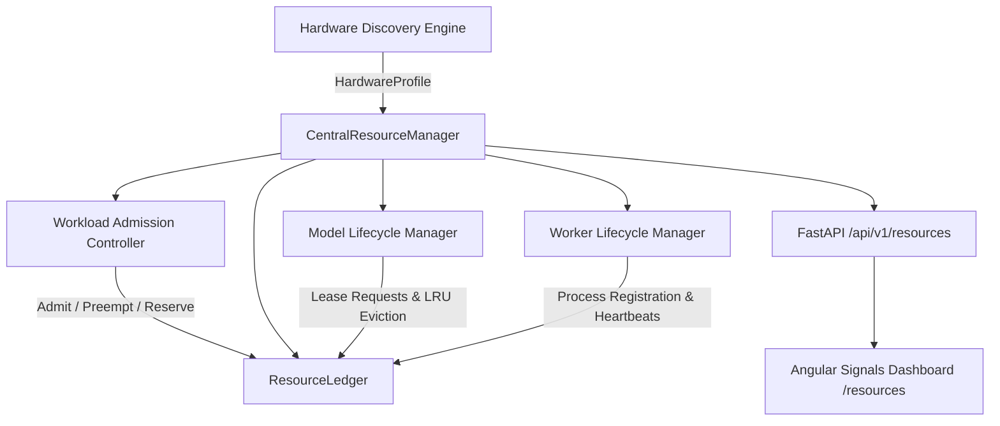
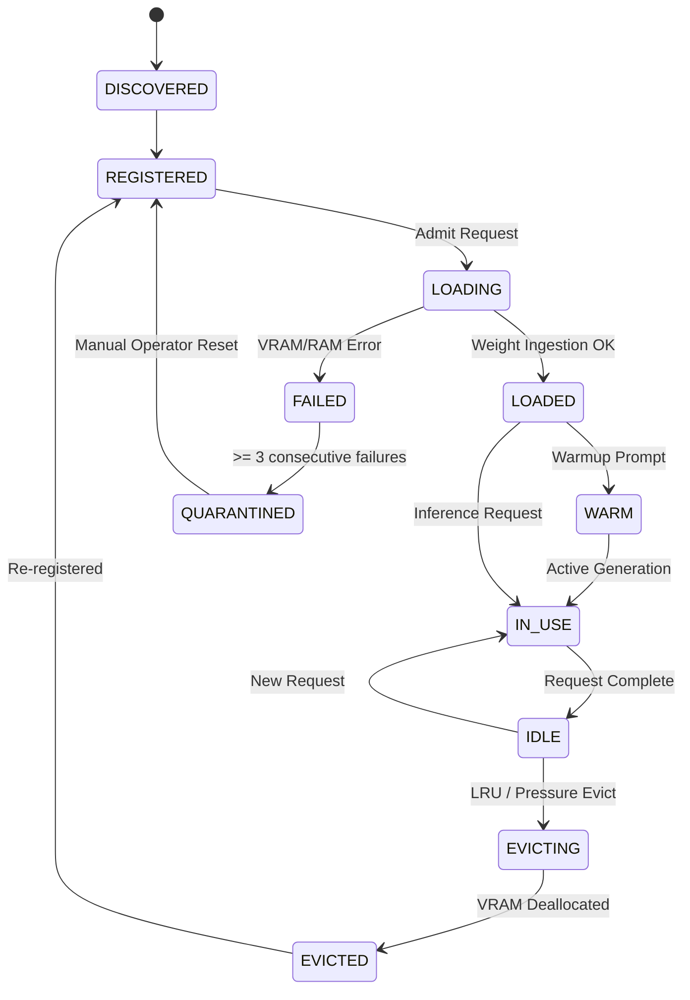

# ABHI Resource & Model Lifecycle Architecture (Phase 7 Stage 7.6)

## 1. System Overview & Core Philosophy
The ABHI **Resource & Model Lifecycle Manager** is a deterministic, local-first resource governor designed to arbitrate and balance computing constraints on heterogeneous host hardware. The system enforces strict physical budgeting across CPU, RAM, GPU VRAM, NPU, Storage, Processes, and AI Models (LLM, Vision, Audio STT/TTS, and Embedding).

---

## 2. Component Separation & Core Contracts

### 2.1 Model Registry vs. Model Instance vs. Resource Lease
* **Model Registry (`ModelMetadata`)**: Static metadata describing model capabilities, formats (GGUF/Ollama), parameter counts (8B, 1.5B), context limits (8192, 4096), and baseline disk/memory footprint.
* **Model Instance (`ModelInstanceRecord`)**: Live in-memory runtime state (`REGISTERED`, `LOADING`, `LOADED`, `WARM`, `IN_USE`, `IDLE`, `EVICTING`, `EVICTED`, `FAILED`, `QUARANTINED`), device mapping (`GPU`, `CPU`), prompt/token generation counters, and dynamic KV cache estimations.
* **Resource Lease (`ResourceLease`)**: Time-bounded, priority-ordered reservation of specific resource slices (`VRAM`, `RAM`, `CPU_CORES`, `GPU_COMPUTE`, `NPU_COMPUTE`) tied to an explicit `owner_type` (`model`, `worker`, `workflow`, `safety`) and `owner_id`.

---

## 3. Hardware Profile & Safety Margins

### 3.1 Host Hardware Specifications (AMD + NVIDIA Ada/Blackwell Baseline)
* **CPU**: AMD Ryzen 7 260 (8 Physical Cores / 16 Logical Threads).
* **RAM**: 24 GB DDR5 System Memory (Total MB: ~24,425 MB).
* **GPU**: NVIDIA GeForce RTX 5050 Laptop GPU (8,151 MB GDDR6 VRAM, Driver 592.82, CUDA 13.1).
* **NPU**: AMD Ryzen AI NPU — Explicitly validated; when no ONNX runtime / DirectML execution provider is loaded, marked as `UNSUPPORTED` / `UNAVAILABLE`.
* **Storage**: Primary OS & Cache partitions tracked with free-space alarms.

### 3.2 Dynamic Reservation & Usable Memory Formula
To prevent host freezing, out-of-memory kernel panics, or display driver crashes, strict safety reserves are enforced:

$$\text{usable\_vram} = \text{total\_vram} - \text{reserve} - \text{margin}$$
$$\text{usable\_ram} = \text{total\_ram} - \text{reserve}$$

* **VRAM**: 8,151 MB Total $-$ 1,200 MB System Reserve $-$ 450 MB Safety Margin = **6,501 MB Usable VRAM**.
* **RAM**: 24,425 MB Total $-$ 4,000 MB OS Reserve = **20,425 MB Usable RAM**.

---

## 4. Priority Hierarchy & Preemption Matrix

| Priority Tier | Value | Description | Preemptible |
|---|---|---|---|
| `P0_EMERGENCY_SAFETY` | 100 | Critical safety stop, watchdog, emergency recovery | NO |
| `P1_INTERACTIVE_USER` | 90 | Direct voice/UI command, interactive chat, real-time typing | NO |
| `P2_REALTIME_PERCEPTION` | 80 | Real-time screen capture, OCR, visual grounding | NO |
| `P3_HIGH_PRIORITY_WORKFLOW` | 70 | Active workflow execution steps, DAG critical paths | NO |
| `P4_STANDARD_EXECUTION` | 60 | Normal skill execution, browser automation, document parsing | YES (by P0-P2) |
| `P5_BACKGROUND_TASKS` | 40 | Periodic indexing, background memory summarization | YES |
| `P6_EVALUATION_EXPERIMENTS` | 20 | Offline benchmark runs, prompt tuning evaluations | YES |
| `P7_OPTIONAL_MAINTENANCE` | 10 | Cache compression, disk cleanup, orphan sweeps | YES |

### 4.1 Candidate Model & Evaluation Isolation
Under elevated or high pressure, candidate models (`is_candidate=True`) and evaluation workloads (`P6`/`P7`) are strictly isolated and prevented from competing with or evicting production inference models (`is_production=True`).

---

## 5. Model Lifecycle State Machine & LRU Eviction

* **LRU Eviction**: When model concurrency limit is reached or VRAM pressure requires space for a higher-priority model, the least-recently-used `IDLE` or `LOADED` model is evicted. `IN_USE` models are strictly immune to eviction.
* **Failure Escalation**: After 3 consecutive load or runtime failures, the model is transitioned to `QUARANTINED` to prevent repeated system disruption.

---

## 6. Worker Lifecycle & Protected Orphan Reconciliation
* Workers register with PID, parent PID, creation timestamp, role (`BROWSER`, `UIA`, `PERCEPTION`, `OCR`), and heartbeat intervals.
* **Heartbeat Watchdog**: Workers missing heartbeats beyond the timeout are flagged `ORPHAN` and terminated safely.
* **Protected System Process Immunity**: The orphan reaper explicitly ignores system processes (`explorer.exe`, `svchost.exe`, `python.exe` supervisor, `ollama.exe`) to prevent accidental host instability.

---

## 7. Operating Modes & Degraded State Progression
1. **BALANCED** (Default): Optimal balance; standard safety reserves; max 2 concurrent active LLMs; standard timeouts.
2. **PERFORMANCE**: Aggressive caching; higher concurrent model limits; reduced safety margins for heavy batch tasks.
3. **CONSERVATIVE**: Strict memory caps; single active LLM; aggressive LRU eviction; higher reserves.
4. **RESOURCE_SAVER**: Background tasks suspended; minimum footprint; fast idle model unload (30s).

### Degraded Capability Modes
* `FULL_CAPABILITY`: All devices operating normally.
* `DEGRADED_VRAM_FALLBACK`: GPU VRAM full; fallback to CPU RAM quantization.
* `DEGRADED_CPU_THROTTLED`: CPU pressure elevated; concurrency throttled.
* `MINIMAL_SURVIVAL`: System memory critical; all non-essential models and workers evicted.
