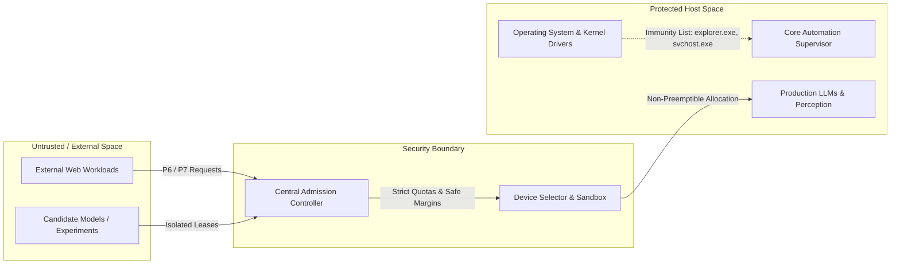

# ABHI Resource Manager Security Model (Phase 7 Stage 7.6)

## 1. Threat Model & Security Perimeter

The ABHI Resource & Model Lifecycle Manager enforces security, isolation, and safe execution across local host boundaries. In a local-first automation system that interacts with local LLMs, screen perceptions, and OS automation workers, resource exhaustion or unauthorized process intervention represents a critical vector for denial-of-service (DoS) or host instability.

---

## 2. Protected System Entities & Process Immunity

To prevent the autonomous worker lifecycle manager or orphan reconciliation routines from destabilizing the Windows host environment, strict name and PID immunity is enforced.

### 2.1 Protected Process Roster
* `explorer.exe` (Windows Shell & Desktop UI)
* `dwm.exe` (Desktop Window Manager)
* `csrss.exe`, `lsass.exe`, `services.exe`, `smss.exe`, `svchost.exe` (Core OS Services)
* `wininit.exe`, `winlogon.exe` (Windows Logon & Init)
* `conhost.exe`, `RuntimeBroker.exe`, `SearchHost.exe`
* `ollama.exe`, `ollama_llama_server.exe` (Local Inference Engine Daemons)
* `python.exe` (Supervisor & Active Automation Process Trees)

### 2.2 Reconciler Safety Invariants
1. **Never Terminate Protected Processes**: Any PID belonging to the protected roster is immediately bypassed during orphan scans.
2. **Graceful Escalation**: Reconciler first issues `SIGTERM` / `proc.terminate()`, waits for a grace period (2.0s), and only issues `SIGKILL` / `proc.kill()` if unresponsive.
3. **Parent PID Validation**: Unregistered orphan candidates must match known automation worker fingerprints (`chrome.exe`, `msedge.exe`, `playwright`, `tesseract.exe`) before being targeted for cleanup.

---

## 3. Candidate Isolation & Safe Preemption

### 3.1 Candidate Model Sandbox
Experimental or benchmark models (`is_candidate=True`) are strictly isolated from production inference:
* Under `ELEVATED`, `HIGH`, or `CRITICAL` memory pressure, candidate model requests are rejected (`AdmitDecision.DENIED`).
* Candidate models can never evict or preempt production models (`is_production=True`).
* Background evaluation experiments are assigned low priority (`P6_EVALUATION_EXPERIMENTS`, priority 20) and yield immediately upon incoming interactive user requests (`P1`, priority 90).

### 3.2 Preemption Safety Controls
* Preemption is only initiated by higher-priority workloads ($P_{\text{request}} > P_{\text{holder}}$).
* Models actively generating tokens (`IN_USE`) or workflows executing atomic hardware actions are marked non-preemptible until the current step completes.

---

## 4. Telemetry Data Provenance & Audit Trail

All telemetry metrics emitted by the Resource Manager are explicitly stamped with `DataProvenance` tags:
* `ACTUAL`: Hardware metrics verified via system APIs (`psutil`, `nvidia-smi`).
* `MEASURED`: Time-series sampled readings directly from device query counters.
* `ESTIMATED`: Formulaic calculations (e.g. KV-cache memory based on context length and layer architecture).
* `SIMULATED`: Fallback or mock driver outputs when running in test harnesses.

All admission decisions, preemption events, orphan terminations, and model state transitions are logged to the in-memory telemetry ring buffer (`max_events=500`) and exposed for operator auditing.
