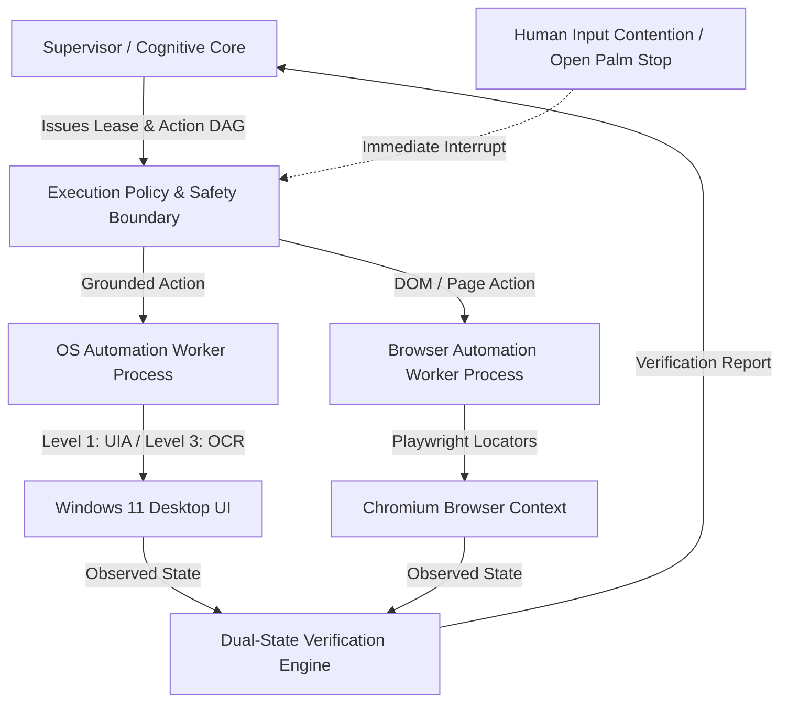

# Phase 5 Readiness Contract: Autonomous OS & Browser Automation

**Status:** APPROVED & LOCKED  
**Date:** 2026-09-25  
**Baseline Commit:** `1e1361c` (Phase 4 Verified)  

---

## 1. Scope & Execution Boundaries

Phase 5 implements autonomous physical desktop and web interaction under strict execution safety leases and dual-state verification.

---

## 2. Phase 5 Core Subsystems

### A. Windows Desktop Automation Worker (`OSAutomationWorker`)
* **Execution Boundary:** Dedicated Python subprocess isolated from Central Gateway.
* **Grounding Hierarchy:**
  1. **Level 1 (Preferred):** Windows UI Automation (`pywinauto` / UIA3 C# wrapper) using `AutomationId`, `Name`, `ControlType`.
  2. **Level 2:** Win32 Accessibility API tree navigation.
  3. **Level 3:** Screen OCR & Visual Grounding (`screen_ocr.py`) to resolve bounding boxes.
  4. **Level 4:** Raw coordinates with pre/post visual confirmation only.
* **Capabilities:** Window focus/switch, application launching, keyboard keystroke injection, grounded mouse clicks, scrolling, clipboard read/write.

### B. Autonomous Browser Automation Worker (`BrowserAutomationWorker`)
* **Execution Boundary:** Dedicated Playwright Chromium subprocess.
* **Grounding Hierarchy:**
  1. Semantic DOM locators (`getByRole`, `getByLabel`, `getByTestId`, CSS/XPath).
  2. Accessibility tree inspection.
  3. Visual screenshot grounding fallback.
* **Capabilities:** Navigation, page inspection, form filling, downloads, click dispatches, multi-tab switching.

### C. Coding & File Automation
* **Execution Boundary:** Dedicated in-process agent with sandboxed file path resolution restricted to workspace / specified project folders.
* **Capabilities:** File reading, AST patching, search, diff application, scratch execution.

---

## 3. Safety Leases & Control Models

1. **Automation Execution Lease:**
   - Every physical action is bound to an `AutomationLease(lease_id, task_id, risk_tier, ttl_seconds, max_actions)`.
   - Max single-action timeout: 10s. Max sub-task lease TTL: 30s.
   - Immediate lease revocation upon human input contention or `OPEN_PALM` emergency stop.

2. **Human-AI Input Contention:**
   - Detects physical operator mouse movement or keypress during automation.
   - Triggers an instant automation pause, releasing mouse hooks and yielding control to the user.

3. **Multi-Frame Gesture Confirmation:**
   - `THUMBS_UP` requires >= 5 consecutive frames (confidence >= 0.85, 1000ms debounce) to transition from candidate signal to consent grant.
   - `OPEN_PALM` immediately triggers high-priority asynchronous Emergency Stop.

4. **Dual-State Pre/Post Verification:**
   - Precondition: Verify target window/DOM element is focused and visible.
   - Action Execution: Dispatch grounded action through execution policy.
   - Postcondition: Observe physical state change (new window title, URL change, DOM mutation, UI text update). Mismatch triggers bounded retry (max 3) or safe failure.

---

## 4. Phase 5 Exclusions (Forbidden in Phase 5)

* No diffusion or video media generation (Reserved for Phase 7).
* No destructive OS actions (e.g. `rmdir /s /q C:\`, registry deletion) without explicit multi-modal human consent gates.
* No arbitrary ungrounded coordinate clicking.
