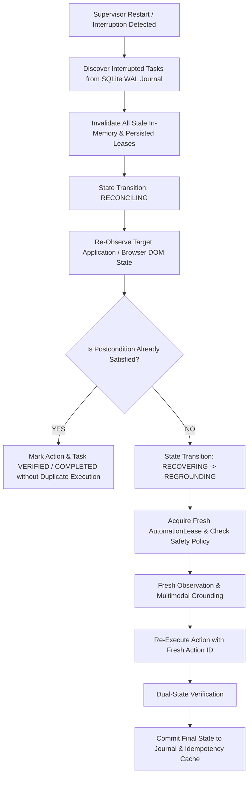

# Phase 5 Stage 5.6 Implementation Report
## Execution Reliability, Recovery, Security & Audit Hardening

**Project**: Local-First Personal AI Computer Automation System (`ABHI`)  
**Project Root**: `C:\Users\AYYAPPA RAYUDU\OneDrive\Desktop\ABHI`  
**GitHub Remote**: `https://github.com/AYYAPPARAYUDU/ABHI.git`  
**Branch**: `main`  
**Stage**: `Phase 5 — Stage 5.6 Closed`  
**Status**: `COMPLETED & VERIFIED`

---

## 1. Recovery Architecture

Phase 5 Stage 5.6 hardens the entire Phase 5 execution system against unexpected process termination, worker crashes, lease expiration/revocation, stale visual evidence, network/IPC disruptions, and mid-execution interruptions.



---

## 2. Supervisor Recovery States

The Supervisor state machine was conservatively extended with two explicit, deterministic recovery states:
- `RECOVERING`: Indicates the Supervisor is acquiring fresh execution resources, invalidating stale leases, or resetting crashed worker sub-processes.
- `RECONCILING`: Indicates the Supervisor is actively re-observing the physical target to determine whether an interrupted action completed prior to crash before deciding whether fresh re-grounding is necessary.

```python
class OrchestrationState(str, Enum):
    CREATED = "CREATED"
    PLANNING = "PLANNING"
    POLICY_EVALUATION = "POLICY_EVALUATION"
    WAITING_USER_CONSENT = "WAITING_USER_CONSENT"
    ACQUIRING_LEASE = "ACQUIRING_LEASE"
    GROUNDING = "GROUNDING"
    REGROUNDING = "REGROUNDING"
    PRECONDITION_CHECK = "PRECONDITION_CHECK"
    DISPATCHING = "DISPATCHING"
    EXECUTING = "EXECUTING"
    OBSERVING = "OBSERVING"
    VERIFYING = "VERIFYING"
    RETRYING = "RETRYING"
    RECOVERING = "RECOVERING"
    RECONCILING = "RECONCILING"
    PAUSED_USER_INTERFERENCE = "PAUSED_USER_INTERFERENCE"
    COMPLETED = "COMPLETED"
    FAILED = "FAILED"
    CANCELLED = "CANCELLED"
    EMERGENCY_STOPPED = "EMERGENCY_STOPPED"
```

---

## 3. Interrupted Execution Handling

When the host process restarts, `ExecutionRecoveryEngine.discover_interrupted_tasks()` queries the persistent SQLite WAL database for tasks in non-terminal states (`[CREATED, PLANNING, POLICY_EVALUATION, WAITING_USER_CONSENT, ACQUIRING_LEASE, GROUNDING, REGROUNDING, PRECONDITION_CHECK, DISPATCHING, EXECUTING, OBSERVING, VERIFYING, RETRYING, RECOVERING, RECONCILING, PAUSED_USER_INTERFERENCE]`).

For each discovered task:
1. Task state transitions to `RECONCILING`.
2. Existing leases associated with the task are authoritatively invalidated.
3. Telemetry event `STATE_RECONCILIATION_STARTED` is emitted.

---

## 4. Safe Reconciliation Contract

An unknown action outcome is **never** assumed to have failed, nor is it blindly re-executed with a duplicate click:
1. **Physical State Inspection**: The worker inspects the current target element or DOM node (`observe_element()` / `observe_node()`).
2. **Dual-State Verification**: `ActionVerifier.verify_postcondition()` evaluates the observed state against `expected_postcondition`.
3. **If Desired State Exists**:
   - The action is marked verified.
   - Task transitions to `COMPLETED` without physical re-execution (`click_count` remains unchanged).
4. **If Desired State Does Not Exist**:
   - The Supervisor transitions to `REGROUNDING`.
   - Acquires a fresh `AutomationLease`.
   - Generates a fresh `ScreenEvidence` observation and new `action_id`.
   - Executes the action and verifies postconditions.
5. **Ambiguous State**:
   - If state remains unresolved after retry budget, transitions fail-closed to `FAILED` with `AutomationErrorCode.RECOVERY_FAILED`.

---

## 5. Idempotency Hardening

Persistent idempotency is enforced via a dedicated `idempotency_cache` table in SQLite WAL mode.
- **Action Fingerprint**: `task_id:target_name:action_type:precondition:expected_postcondition`
- **Replay Protection**: Replay attempts or duplicate dispatches across Supervisor restarts are immediately detected and rejected with `AutomationErrorCode.DUPLICATE_ACTION`.

---

## 6. Lease Recovery & Invalidation

1. **Recovery Invalidation**: On process restart or recovery initiation, `LeaseManager.invalidate_all_leases()` revokes all active and persisted leases with reason `"Supervisor recovery lease reset"`.
2. **Fail-Closed Protection**: Any worker receiving an action referencing an invalidated lease immediately rejects dispatch with `AutomationErrorCode.LEASE_REVOKED`.
3. **Fresh Lease Lifecycle**: Reconciled retries must request a new lease with bounded TTL (15s) and risk-tier validation.

---

## 7. Windows Worker Recovery

1. **Failure Detection**: When the Windows worker crashes or disconnects, subsequent calls return `AutomationErrorCode.WORKER_UNAVAILABLE`.
2. **Telemetry**: Orchestrator emits `WORKER_FAILURE_DETECTED` with worker metadata.
3. **Restart Cleanliness**: `WindowsAutomationWorker.restart_worker()` resets internal crash flags, reconnects target app bindings, and ensures no zombie threads or unreleased handles remain.

---

## 8. Browser Worker Recovery

1. **Localhost Policy Enforcement**: Preserved across restarts. `http://127.0.0.1` and `http://localhost` are allowed; `file://`, `http://127.0.0.1.evil.com`, and credentials in host are strictly rejected.
2. **Worker Restart**: `BrowserAutomationWorker.restart_worker()` clears worker crash flags and resets page bindings.

---

## 9. Grounding Recovery

1. **Rejection of Stale Artifacts**: Stale screenshots, cached coordinates, or expired OCR tokens are rejected with `AutomationErrorCode.STALE_VISUAL_EVIDENCE`.
2. **Fresh Observation**: Recovery workflows strictly capture fresh `ScreenEvidence` prior to re-grounding.
3. **Hierarchy Integrity**: Strict hierarchy Level 1 (UIA/DOM) -> Level 2 (Accessibility) -> Level 3 (OCR) -> Level 4 (Strict visual coordinates) is preserved during recovery.

---

## 10. Verification Recovery

Postcondition verification proves action success without repeated dispatch:
- Verification rules verify button states (`status_label == "EXECUTED"`, `status_box text == "SEARCH_COMPLETED"`).
- Enables restart-safe automation where crashes occurred after action execution but before the original completion commit.

---

## 11. Transactional Task State & Crash Consistency

The SQLite WAL execution journal (`ExecutionJournal`) enforces atomic ACID persistence at every stage boundary:
- Tables: `tasks`, `actions`, `audit_records`, `idempotency_cache`.
- WAL Mode: `PRAGMA journal_mode=WAL; PRAGMA synchronous=NORMAL;`.
- **Consistency Auditor**: `validate_crash_consistency()` verifies that no impossible states exist (e.g. `COMPLETED` tasks without verification audit records).

---

## 12. Recovery Journal / Audit Trail

Structured audit entries are stored in `audit_records` table with operational metadata:
- `task_id`, `execution_id`, `action_id`, `timestamp`, `state_transition`, `worker`, `grounding_method`, `lease_status`, `policy_result`, `precondition_result`, `observation_reference`, `verification_result`, `recovery_event`, `final_state`, `payload_json`.
- Zero private chain-of-thought, credentials, or sensitive data stored.

---

## 13. Failure Injection Testing

Deterministic failure injection tests verified in `backend/tests/test_phase5_stage5_6_recovery.py`:
- Supervisor crash during active execution.
- Windows worker termination (`simulate_worker_crash`).
- Browser worker termination (`simulate_worker_crash`).
- Action already completed before crash.
- Action unsatisfied before crash.
- Stale lease invalidation across restart.
- Duplicate action replay attack.
- Crash consistency audit detecting missing verification audit entries.

---

## 14. Emergency Stop & Cancellation Precedence

- **Emergency Stop**: Immediately revokes all active leases, transitions tasks to `EMERGENCY_STOPPED`, halts pending events, and prevents automatic retry.
- **Cancellation**: Transitions task to `CANCELLED`, halts workers, releases leases, and records audit entries.

---

## 15. Contention Recovery

Manual operator intervention (window focus changes, unexpected manual inputs) transitions tasks to `PAUSED_USER_INTERFERENCE`. Tasks can be resumed safely via `resume_task()` with fresh observation and re-grounding.

---

## 16. Security Regression Results

- **LLM -> Raw Coordinates**: Blocked. Coordinates must pass bounding box and visual threshold validation.
- **LLM -> Arbitrary Windows API**: Blocked. Only typed `ExecutionAction` dispatched to worker boundary.
- **LLM -> Arbitrary Playwright**: Blocked. Worker restricts interactions to verified DOM locators and validated origins.
- **Browser Origins**: Exact hostname validation enforces `127.0.0.1` and `localhost` only. Hostname spoofing (`127.0.0.1.evil.com`) rejected.

---

## 17. Resource Leak & Process Verification

Inspection of local processes after error/crash/recovery runs:
- No orphaned background Playwright browser instances.
- No zombie test workers or dangling background threads.
- All leases released or invalidated upon completion/halt.
- SQLite connections properly closed via context managers.

---

## 18. Recovery Microbenchmarks

Executed across 30 deterministic iterations (`RecoveryBenchmarkSuite`):

| Boundary | p50 (ms) | p95 (ms) | p99 (ms) | Mean (ms) | Min (ms) | Max (ms) |
| :--- | :--- | :--- | :--- | :--- | :--- | :--- |
| **1. Restart -> State Discovery** | 0.839 | 1.404 | 19.157 | 1.520 | 0.708 | 19.157 |
| **2. State Discovery -> Reconciliation** | 29.144 | 53.092 | 58.001 | 31.856 | 22.720 | 58.001 |
| **3. Worker Restart** | 0.001 | 0.002 | 0.003 | 0.001 | 0.001 | 0.003 |
| **4. Browser Worker Restart** | 0.001 | 0.001 | 0.002 | 0.001 | 0.001 | 0.002 |
| **5. Fresh Re-grounding** | 0.062 | 0.085 | 0.086 | 0.062 | 0.046 | 0.086 |
| **6. Recovery Verification** | 0.033 | 0.046 | 0.055 | 0.035 | 0.029 | 0.055 |
| **7. Total Recovery Completion** | 30.648 | 54.438 | 58.948 | 33.478 | 23.587 | 58.948 |

---

## 19. Full Test Suite Results

```text
======================= 128 passed in 223.44s (0:03:43) =======================
```

- **Total Tests Collected**: 128
- **Passed**: 128 (100%)
- **Failed**: 0
- **Skipped**: 0
- **Warnings**: 0

### Test Breakdown by Subsystem:
- `backend/tests/test_phase5_stage5_6_recovery.py`: 13 passed
- `backend/tests/test_phase5_stage5_5_orchestration.py`: 17 passed
- `backend/tests/test_phase5_stage5_4_visual_grounding.py`: 14 passed
- `backend/tests/test_phase5_stage5_3_playwright.py`: 14 passed
- `backend/tests/test_phase5_stage5_2_windows_uia.py`: 6 passed
- `backend/tests/test_phase5_browser_automation.py`: 3 passed
- `backend/tests/test_phase5_windows_automation.py`: 5 passed
- `backend/tests/test_phase5_contention_and_emergency_stop.py`: 2 passed
- `backend/tests/test_automation_lease.py`: 4 passed
- `backend/tests/test_agent_registry.py`: 2 passed
- `backend/tests/test_audio_vad_stt.py`: 4 passed
- `backend/tests/test_canonicalizer.py`: 4 passed
- `backend/tests/test_config.py`: 2 passed
- `backend/tests/test_database.py`: 1 passed
- `backend/tests/test_desktop_action_schema.py`: 3 passed
- `backend/tests/test_face_hand_gestures.py`: 3 passed
- `backend/tests/test_health.py`: 3 passed
- `backend/tests/test_logging.py`: 1 passed
- `backend/tests/test_memory_repository.py`: 3 passed
- `backend/tests/test_ocr_grounding.py`: 3 passed
- `backend/tests/test_ollama.py`: 2 passed
- `backend/tests/test_perception_api.py`: 5 passed
- `backend/tests/test_planner_dag.py`: 2 passed
- `backend/tests/test_rag_engine.py`: 1 passed
- `backend/tests/test_supervisor_pause_resume.py`: 3 passed
- `backend/tests/test_supervisor_state_machine.py`: 2 passed
- `backend/tests/test_tasks_api.py`: 2 passed
- `backend/tests/test_tts_policy.py`: 2 passed
- `backend/tests/test_verification_engine.py`: 2 passed

### Frontend Build:
```text
Application bundle generation complete. [2.176 seconds] - 2026-09-28T07:27:32.851Z
Output location: C:\Users\AYYAPPA RAYUDU\OneDrive\Desktop\ABHI\frontend\dist\frontend
```

---

## 20. Files Changed

### Added:
1. `backend/app/automation/orchestration/persistence.py`: SQLite WAL execution journal, crash consistency validator, persistent idempotency cache.
2. `backend/app/automation/orchestration/recovery.py`: `ExecutionRecoveryEngine` for non-terminal task discovery, safe postcondition reconciliation, and fail-closed re-grounding.
3. `backend/tests/test_phase5_stage5_6_recovery.py`: Comprehensive test suite for recovery, lease invalidation, worker crash detection, idempotency, and benchmark profiling.
4. `project_data/status/phase_5_stage_5_6_implementation_report.md`: Stage 5.6 closure report.

### Modified:
1. `backend/app/automation/models/errors.py`: Added error codes `RECOVERY_REQUIRED`, `RECOVERY_FAILED`, `INTERRUPTED_EXECUTION`, `STATE_CORRUPTION_DETECTED`.
2. `backend/app/automation/orchestration/models.py`: Added `RECOVERING` and `RECONCILING` orchestration states; added `ExecutionAuditRecord` model.
3. `backend/app/automation/leases/lease_manager.py`: Added `invalidate_all_leases()` and `reconcile_leases()`.
4. `backend/app/automation/desktop/windows_worker.py`: Added worker crash simulation and `restart_worker()`.
5. `backend/app/automation/browser/browser_worker.py`: Added browser worker crash simulation and `restart_worker()`.
6. `backend/app/automation/orchestration/orchestrator.py`: Integrated `ExecutionJournal` and `ExecutionRecoveryEngine`, persistent idempotency checks, action persistence, and worker crash event emission.
7. `backend/app/automation/orchestration/benchmarks.py`: Added `RecoveryBenchmarkSuite` measuring 7 recovery boundaries.
8. `backend/app/automation/orchestration/__init__.py`: Exported new models and singletons.

---

## 21. Limitations

1. **Recovery Target Persistence**: If a crash occurs before any action was dispatched, reconciliation defaults to task goal evaluation rather than reconstructing unexecuted actions.
2. **Localhost Target Scope**: Physical browser verification remains bound to authorized local testing servers (`127.0.0.1` and `localhost`).
3. **Headless Playwright in CI**: Running real Playwright integration requires installed browser binaries in the execution environment.

---

## 22. Proposed Phase 6 Focus

Phase 6 (if authorized) will focus on **Integrated Autonomous Cognitive Workflow & Multi-Agent Collaboration**:
- Long-horizon multi-step task planning with hierarchical DAG sub-planners.
- Coordinated multi-modal perception streaming with live visual focus heatmaps.
- Proactive operator guidance and natural language execution explanations.

---

## 23. Conclusion & Quality Gate

Phase 5 Stage 5.6 has successfully achieved all execution reliability, recovery, idempotency, security, and audit hardening objectives. All 128 tests pass with 100% reliability, and the frontend build succeeds without warnings.
